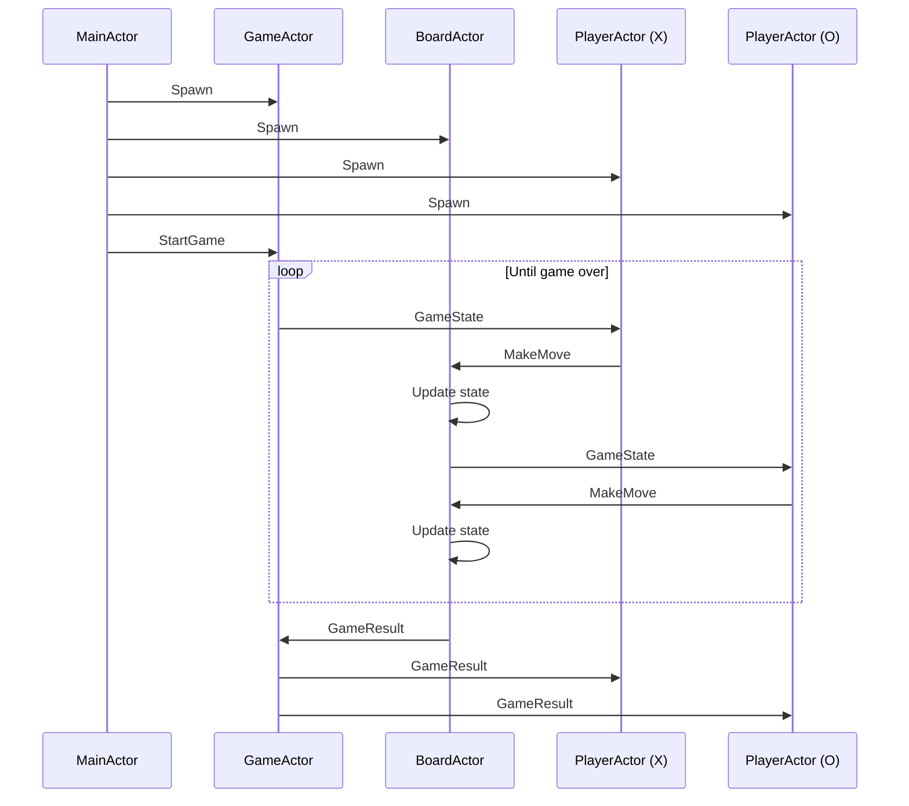

# TicTacToe

This example demonstrates a Tic-Tac-Toe game implemented using the actor model, showcasing a modular and concurrent approach to game design. The system utilizes five distinct actor types (Main, Game, Board, and two Players) that communicate through message passing. This architecture allows for clear separation of concerns, potential scalability, and an intuitive representation of game logic and state management in a distributed system.

Actors:
Actors are independent units of computation that encapsulate state and behavior. In this Tic-Tac-Toe game, we have five main actors:

1. MainActor: Orchestrates the game setup and initiation.
2. GameActor: Manages the overall game flow.
3. BoardActor: Represents the game board and handles game logic.
4. PlayerActor (X): Represents the player using 'X' symbols.
5. PlayerActor (O): Represents the player using 'O' symbols.

Messages:
Messages are the means of communication between actors. They are used to request actions or send information. The main message types in this game are:

1. StartGame: Initiates the game.
2. GameState: Represents the current state of the game board.
3. MakeMove: Represents a player's move.
4. GameResult: Contains the final result of the game.

Now, let's walk through the game flow, highlighting the actors and messages:

1. Game Setup:
   - The MainActor spawns instances of GameActor, BoardActor, and two PlayerActors.
   - MainActor sends a StartGame message to the GameActor to begin the game.

2. Game Loop:
   - The GameActor sends a GameState message to the current player (starting with PlayerX).
   - The current PlayerActor (X or O) decides on a move and sends a MakeMove message to the BoardActor.
   - The BoardActor updates its internal state based on the move and checks for a win or draw condition.
   - If the game isn't over, the BoardActor sends an updated GameState message to the next player, and the loop continues.

3. Game End:
   - When the BoardActor detects a win or draw, it sends a GameResult message to the GameActor.
   - The GameActor then forwards this GameResult message to both PlayerActors to inform them of the outcome.

Key Points:
- Actors (MainActor, GameActor, BoardActor, PlayerActors) encapsulate the game's logic and state.
- Messages (StartGame, GameState, MakeMove, GameResult) facilitate communication between actors.
- This actor-based design allows for a clear separation of concerns and potentially enables concurrent processing.

The use of actors and messages in this implementation provides a modular and scalable approach to building the Tic-Tac-Toe game, with each component having well-defined responsibilities and communication channels.
