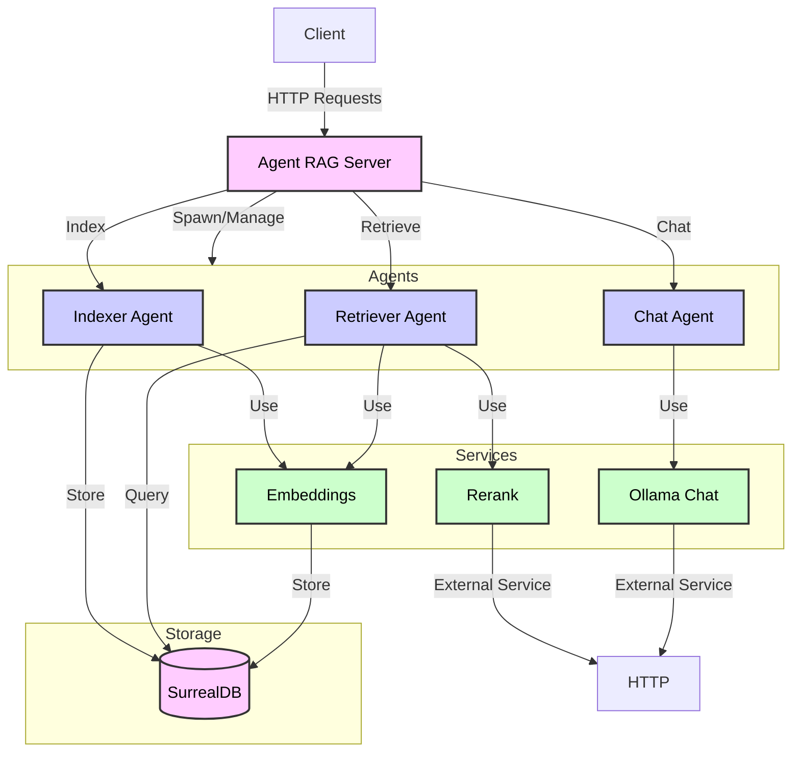
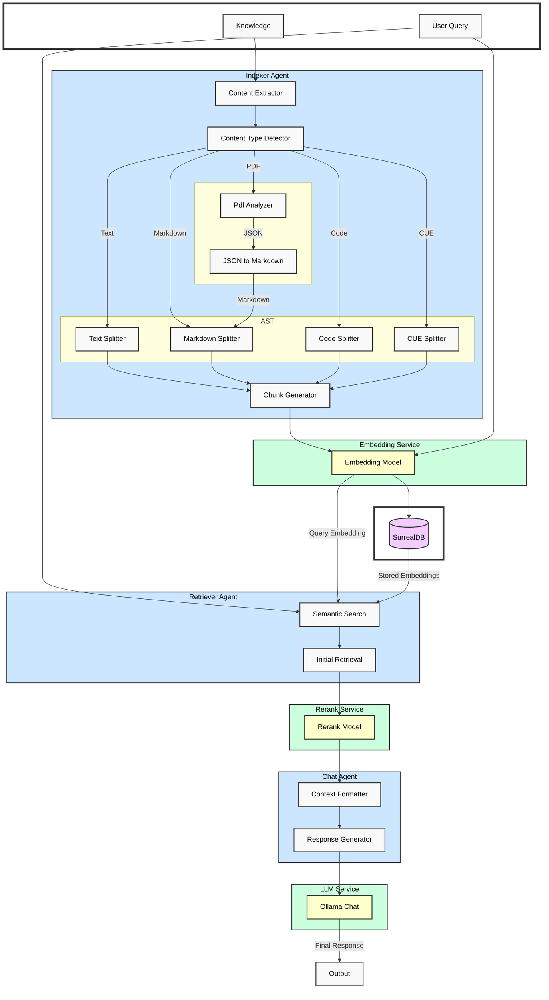

# Agentic RAG Server

## System Architecture

```mermaid
graph TB
    Client[Client]
    RAGServer[Agent RAG Server]
    
    subgraph Agents
        IndexerAgent[Indexer Agent]
        RetrieverAgent[Retriever Agent]
        ChatAgent[Chat Agent]
    end
    
    subgraph Services
        Embeddings[Embeddings]
        Rerank[Rerank]
        OllamaChat[Ollama Chat]
    end
    
    subgraph Storage
        SurrealDB[(SurrealDB)]
    end

    Client -->|HTTP Requests| RAGServer
    RAGServer -->|Spawn/Manage| Agents
    
    RAGServer -->|Index| IndexerAgent
    RAGServer -->|Retrieve| RetrieverAgent
    RAGServer -->|Chat| ChatAgent
    
    IndexerAgent -->|Store| SurrealDB
    IndexerAgent -->|Use| Embeddings
    
    RetrieverAgent -->|Query| SurrealDB
    RetrieverAgent -->|Use| Embeddings
    RetrieverAgent -->|Use| Rerank
    
    ChatAgent -->|Use| OllamaChat
    
    Embeddings -->|Store| SurrealDB
    Rerank -->|External Service| HTTP
    OllamaChat -->|External Service| HTTP

    classDef server fill:#ffccff,stroke:#333,stroke-width:2px,color:#000;
    classDef agent fill:#ccccff,stroke:#333,stroke-width:2px,color:#000;
    classDef service fill:#ccffcc,stroke:#333,stroke-width:2px,color:#000;
    classDef storage fill:#ffccff,stroke:#333,stroke-width:2px,color:#000;
    
    class RAGServer server;
    class IndexerAgent,RetrieverAgent,ChatAgent agent;
    class Embeddings,Rerank,OllamaChat service;
    class SurrealDB storage;
```

## Knowledge Indexing and Retrieval Flow

```mermaid
graph TD

    subgraph Input[" "]
        direction LR
        
        RawDocs[Knowledge]
        Query[User Query]
    end

    subgraph IndexerAgent["Indexer Agent"]
        direction TB
        FileReader[Content Extractor]
        TypeDetector[Content Type Detector]

        subgraph PdfToMarkdown[" "]
            direction TB
            PdfAnalyzer[Pdf Analyzer]
            JsonToMarkdown[JSON to Markdown]
        end
        
        subgraph Splitters["AST"]
            direction LR
            TextSplitter[Text Splitter]
            MarkdownSplitter[Markdown Splitter]
            CodeSplitter[Code Splitter]
            CueSplitter[CUE Splitter]
        end
        
        ChunkGenerator[Chunk Generator]
    end

    subgraph EmbeddingService["Embedding Service"]
        EmbeddingModel[Embedding Model]
    end

    subgraph Storage["_"]
        SurrealDB[(SurrealDB)]
    end

    subgraph RetrieverAgent["Retriever Agent"]
        SemanticSearch[Semantic Search]
        InitialRetrieval[Initial Retrieval]
    end

    subgraph RerankService["Rerank Service"]
        RerankModel[Rerank Model]
    end

    subgraph ChatAgent["Chat Agent"]
        ContextFormatter[Context Formatter]
        ResponseGenerator[Response Generator]
    end

    subgraph LLMService["LLM Service"]
        OllamaChat[Ollama Chat]
    end

    RawDocs --> FileReader
    FileReader --> TypeDetector
    TypeDetector -->|PDF| PdfAnalyzer

    PdfAnalyzer -->|JSON| JsonToMarkdown

    TypeDetector -->|Text| TextSplitter
    TypeDetector -->|Markdown| MarkdownSplitter
    JsonToMarkdown -->|Markdown| MarkdownSplitter
    TypeDetector -->|Code| CodeSplitter
    TypeDetector -->|CUE| CueSplitter
    
    TextSplitter --> ChunkGenerator
    MarkdownSplitter --> ChunkGenerator
    CodeSplitter --> ChunkGenerator
    CueSplitter --> ChunkGenerator
    
    ChunkGenerator --> EmbeddingModel
    EmbeddingModel --> SurrealDB
    
    Query --> EmbeddingModel
    Query --> SemanticSearch
    EmbeddingModel -->|Query Embedding| SemanticSearch
    SurrealDB -->|Stored Embeddings| SemanticSearch
    SemanticSearch --> InitialRetrieval
    InitialRetrieval --> RerankModel
    RerankModel --> ContextFormatter
    ContextFormatter --> ResponseGenerator
    ResponseGenerator --> OllamaChat
    OllamaChat -->|Final Response| Output

    classDef default fill:#f9f9f9,stroke:#333,stroke-width:2px,color:#000;
    classDef agent fill:#cce6ff,stroke:#333,stroke-width:2px,color:#000;
    classDef service fill:#ccffdd,stroke:#333,stroke-width:2px,color:#000;
    classDef storage fill:#f2ccff,stroke:#333,stroke-width:2px,color:#000;
    classDef model fill:#ffffcc,stroke:#333,stroke-width:2px,color:#000;
    classDef compose fill:#ffffff,stroke:#333,stroke-width:4px,color:#000;
    
    class IndexerAgent,RetrieverAgent,ChatAgent agent;
    class EmbeddingService,RerankService,LLMService service;
    class SurrealDB storage;
    class EmbeddingModel,RerankModel,OllamaChat,TreeSitterRust,TreeSitterPython,TreeSitterCue,TreeSitterCpp model;
    class Input,Storage compose;
```
